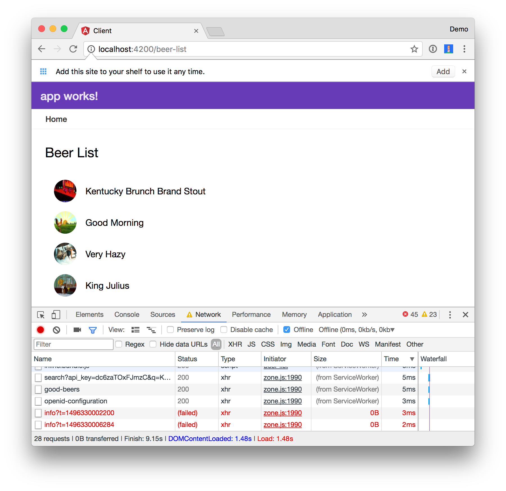
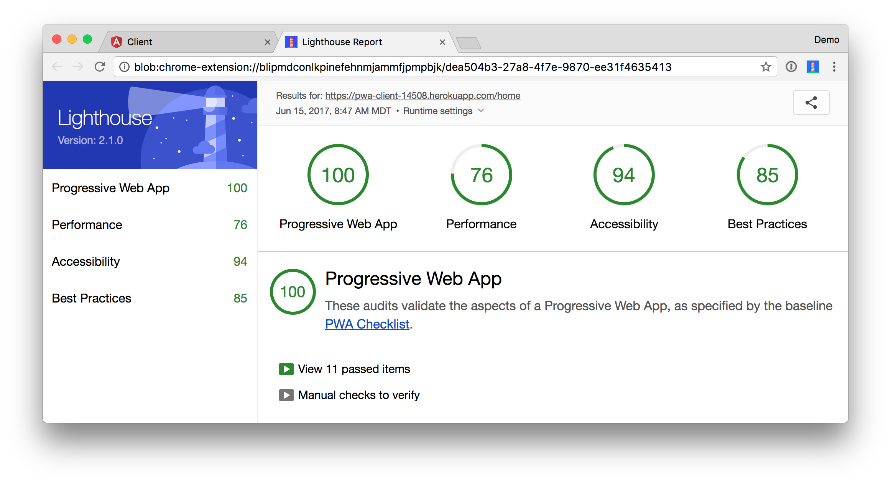

# Spring Boot API with Angular PWA
 
This is an example app that shows how to add Authentication with Okta to an Angular PWA that works offline.

To see how this application was created, please read [Add Authentication to Your Angular PWA](https://developer.okta.com/blog/2017/06/13/add-authentication-angular-pwa) on the Okta Developer blog.

You will need to have an [Okta Developer account](https://developer.okta.com/signup/) and environment variables configured to run this application.

> [Okta](https://developer.okta.com/) has Authentication and User Management APIs that reduce development time with instant-on, scalable user infrastructure. Okta's intuitive API and expert support make it easy for developers to authenticate, manage and secure users and roles in any application.

* [Getting Started](#getting-started)
* [Help](#help)
* [Links](#links)
* [License](#license)

## Getting Started

To install this example application, run the following commands:

```bash
git clone git@github.com:oktadeveloper/okta-spring-boot-angular-pwa-example.git
cd okta-spring-boot-angular-pwa-example
```

This will get a copy of the project installed locally. To install all of its dependencies and start each app, follow the instructions below.

To run the server, cd into the `server` folder and run:
 
```bash
./mvnw spring-boot:run
```

To run the client, cd into the `client` folder and run:
 
```bash
npm install && npm start
```

### Create Applications in Okta

You will need to [create an application in Okta](https://developer.okta.com/blog/2017/06/13/add-authentication-angular-pwa#create-an-application) to configure the Spring Boot side of things.

After creating an app and an access token, you should be able to set the following environment variables:

```
export STORMPATH_CLIENT_BASEURL=[baseurl_from_above]
export OKTA_APPLICATION_ID=[application_id_from_above]
export OKTA_API_TOKEN=[api_token_from_above]
```

After you set these environment variables, make sure to restart Spring Boot with `./mvn spring-boot:run`.

For Angular, you'll need to [create an OIDC app on Okta](https://developer.okta.com/blog/2017/06/13/add-authentication-angular-pwa#create-an-openid-connect-app-for-angular). Change `{clientId}` and `{yourOktaDomain}` in `src/app/app.component.ts` to match your app's values.

```typescript
constructor(private oauthService: OAuthService) {
  this.oauthService.redirectUri = window.location.origin;
  this.oauthService.clientId = '{clientId}';
  this.oauthService.scope = 'openid profile email';
  this.oauthService.oidc = true;
  this.oauthService.issuer = 'https://{yourOktaDomain}.com/oauth2/default';

  this.oauthService.loadDiscoveryDocument().then(() => {
    this.oauthService.tryLogin({});
  });
}
```

You'll also need to specify the `url` in `src/home/home.component.ts`.

```typescript
const authClient = new OktaAuth({
  url: 'https://{yourOktaDomain}.com',
  issuer: 'default'
});
```

**NOTE:** The value of `{yourOktaDomain}` should be something like `dev-123456.oktapreview.com`. Make sure you don't include `-admin` in the value!

After making these changes, you should be able to log in with your credentials at `http://localhost:4200`.

You will be prompted to log in when you first load the client.


On the `stormpath` branch, you can see how to use the [Stormpath Angular SDK](https://github.com/stormpath/stormpath-sdk-angular).


You can use Chrome Developer Tools to toggle offline in the Network tab and prove that it works offline.



## Deploy to the Cloud

See [deploy.sh](deploy.sh) to see how to deploy to Cloud Foundry. See [heroku.sh](heroku.sh) to see how to deploy to Heroku.

## Lighthouse Score

You can see that this app scores 100 as a PWA using [Lighthouse](https://developers.google.com/web/tools/lighthouse/).

Cloud Foundry                                                  |  Heroku
:-------------------------------------------------------------:|:----------------------------------------------------:
 | 

## Links

This example uses the following libraries provided by [Manfred Steyer](https://github.com/manfredsteyer):

* [angular-oauth2-oidc](https://github.com/manfredsteyer/angular-oauth2-oidc)

This example uses the following libraries provided by Okta:

* [Okta Auth SDK](https://github.com/okta/okta-auth-js)

## Help

Please post any questions as comments on the [blog post](https://developer.okta.com/blog/2017/06/13/add-authentication-angular-pwa), or visit our [Okta Developer Forums](https://devforum.okta.com/). You can also email developers@okta.com if would like to create a support ticket. You can also hit me up on Twitter [@mraible](https://twitter.com/mraible).

## License

Apache 2.0, see [LICENSE](LICENSE).