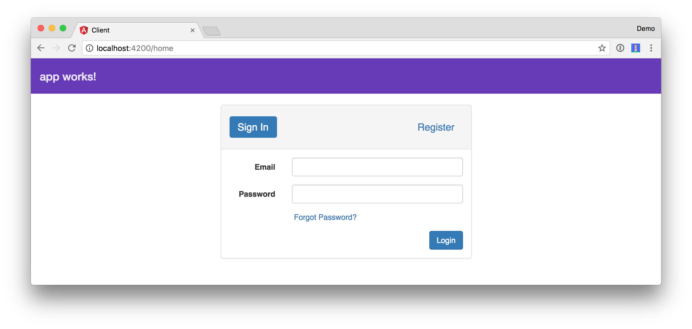

# Spring Boot API with Angular PWA
 
Example app that shows how to add Authentication with Okta to an Angular PWA that works offline.

To see how this application was created, please read [Add Authentication to Your Angular PWA](https://developer.okta.com/blog/2017/06/13/add-authentication-angular-pwa) on the Okta Developer blog.

You will need to have an [Okta Dewveloper account](https://developer.okta.com/signup/) and environment variables
configured to run this application.

To run the server, cd into the `server` folder and run `mvn spring-boot:run`.

To run the client, cd into the `client` folder and run `npm install && ng serve`. Open <http://localhost:4200> to load initial data. You will be prompted to log in when you first load the client.

On the `stormpath` branch, you can see how to use the [Stormpath Angular SDK](https://github.com/stormpath/stormpath-sdk-angular).

You can use Chrome Developer Tools to toggle offline in the Network tab and prove that it works offline.

## Deploy to the Cloud

See [deploy.sh](deploy.sh) to see how to deploy to Cloud Foundry. See [heroku.sh](heroku.sh) to see how to deploy to Heroku.

## Lighthouse Score

You can see that this app scores 100 as a PWA using [Lighthouse](https://developers.google.com/web/tools/lighthouse/).

|||