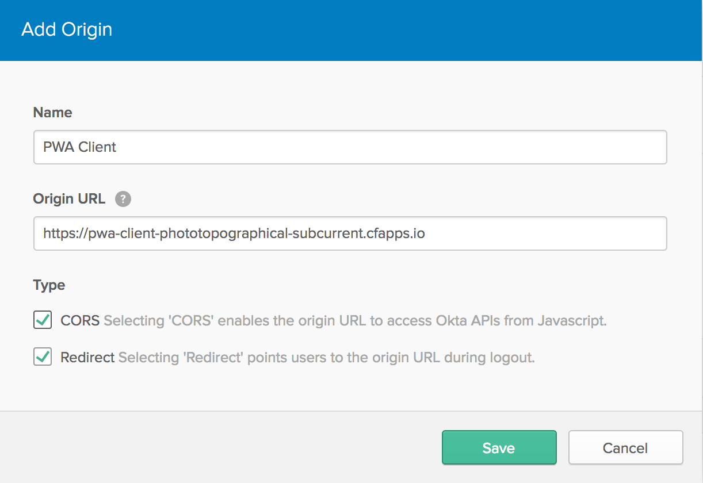
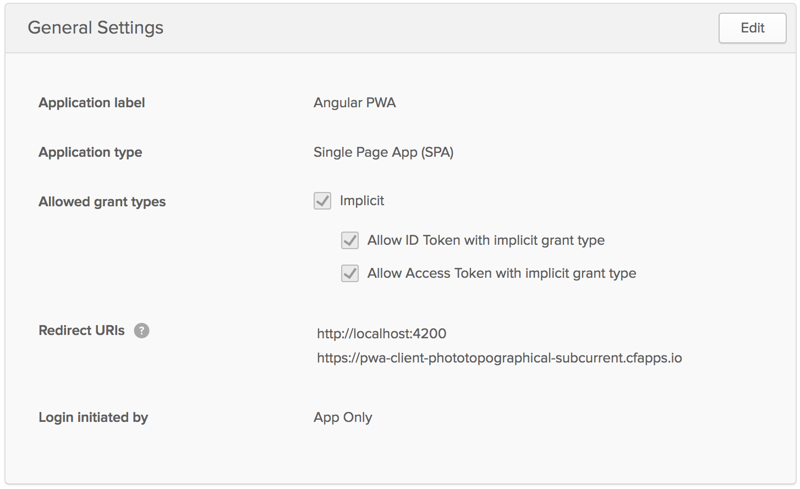
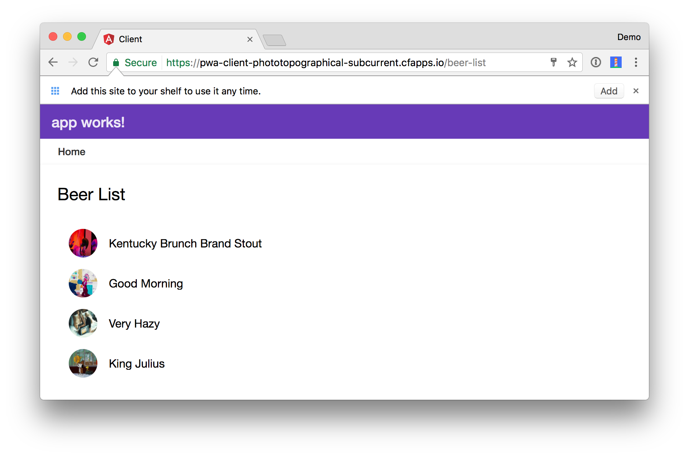
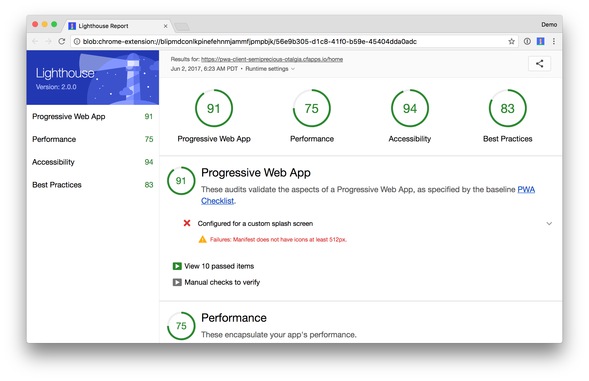
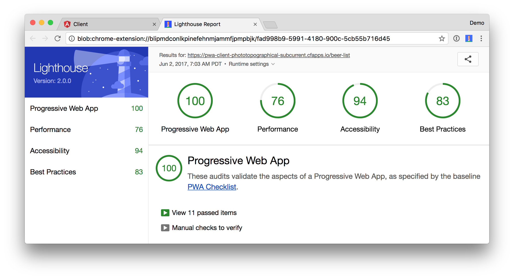

# Adding Authentication to Your Angular PWA

You're developing a Progressive Web Application (PWA) and your service worker and web app manifest are working swimmingly. You've even taken the time to deploy it to a server with HTTPS and you're feeling pretty good about  things. But wait, you don't have any way of knowing who your users are! Don't you want to provide them with an opportunity to authenticate and tell you who they are? Once you know who they are, you can give them all kinds of personalization options, inspire them to ❤️ your app, and maybe even support your work!

In this article, I'll show you how you can lock down a Spring Boot app, then use a modern authentication protocol, in this case Open ID Connect (OIDC), to authenticate and gain access to its APIs. 

## Secure Your Spring Boot App

You might've heard that [Stormpath joined forces with Okta](https://www.okta.com/blog/2017/03/stormpath-welcome-to-Okta/) a few months ago (February 2017). Since the transition, we've been working hard to make the Stormpath SDKs work with Okta's API. The good news is we've made great progress! 

In this example, you'll use a Stormpath's Spring Boot Starter to add security to a Spring Boot app. I'll show you how this starter provides functionality such as login, forgot password, and user registration. 

Then I'll show you how you can use OIDC and Okta's Auth SDK in an Angular app to login and get data from the Spring Boot app. Finally, I'll show how Stormpath's Angular SDK has similar functionality to the Spring Boot Starter, providing login, user registration, and forgot password features.

I recently created a Sping Boot app that provides a list of good beers, based on a pre-populated list. It filters out less-than-great beers and displays them in an Angular UI that displays the first animated GIF (from Giphy) that matches the beer name.

Let's get started! 

Rather than building Spring Boot and Angular applications from scratch, you can clone an existing GitHub project to get you going quickly.

```
git clone https://github.com/oktadeveloper/spring-boot-angular-pwa-example.git
```

If you'd prefer to build this application yourself, please read [Build Your First Progressive Web Application with Angular and Spring Boot](https://developer.okta.com/blog/2017/05/09/progressive-web-applications-with-angular-and-spring-boot).

In this project's `server/pom.xml` file, you'll need to add the following XML:

```xml
<properties>
    <stormpath.version>2.0.0-okta-rc1</stormpath.version>
</properties>

<dependencies>
    ...
    <dependency>
        <groupId>com.stormpath.spring</groupId>
        <artifactId>stormpath-default-spring-boot-starter</artifactId>
    </dependency>
</dependencies>

<dependencyManagement>
    <dependencies>
        <dependency>
            <groupId>com.stormpath.sdk</groupId>
            <artifactId>stormpath-bom</artifactId>
            <version>${stormpath.version}</version>
            <type>pom</type>
            <scope>import</scope>
        </dependency>
    </dependencies>
</dependencyManagement>
```

## Get Started with Okta
 
To begin, you'll need to create an Okta Developer account. This account is free forever and provides the complete Okta Identity Platform for up to 3 applications and 100 users.

1. Head on over to <https://www.okta.com/developer/signup>
2. Fill out the signup form, and click "Get Started"
3. Within a few minutes you'll get a conformation email, follow the instructions in the email to finish setting up your account

Once you're set up you'll receive a couple URLs. The first is an admin console URL that looks something like this: 

https://dev-123456-admin.oktapreview.com/admin/getting-started

Use this one to manually change organization settings, create users, or other general administrative work.  

The other URL looks similar, but is missing the `admin` part: 

https://dev-123456.oktapreview.com/

This is the one your users could interact with, and will be the base URL for any API access.

**Important:** The second URL (the non-admin one) is the one you will need to remember, you will use this URL for API access.
 
To setup your Okta account for Spring Boot, you'll first need to create an application. 

### Create an Application

1. Navigate to your Admin console: i.e. https://dev-123456-admin.oktapreview.com/admin/dashboard
2. On the top menu click on **Applications**
3. Click **Add Application**
4. Click **Create New App**
5. On the *Create a New Application Integration* popup, select the following values, then click **Create**
    - Platform - Native
    - Sign-on Method - OpenID Connect
6. On the *Create OpenID Connect Integration* page, enter the following value, then click **Next**
    - Application Name - Spring Boot Awesomesauce
7. Use `http://localhost:8080/client/callback` for the Redirect URI's, and click **Finish**

Your application has been created, but you still have a few settings to change. 

1. On the *General* tab, click **Edit** on the **General Settings** panel
2. Check the *Refresh Token*, and *Resource Owner Password* checkboxes click **Save**
3. Click **Edit** on the Client Credentials panel
4. Select the *Use Client Authentication* radio button, and click the **Save** button 
5. Click on the *Groups* tab
6. Select *Assign* in the *Everyone* column, and click **Done**
7. Grab the ID portion of the URL of your browser's current page, for example: if my URL was: `https://dev-123456-admin.oktapreview.com/admin/app/oidc_client/instance/00icu81200icu812/#tab-groups` then `00icu81200icu812` is my application's ID

**Important:** You will need to remember your application's ID.

### Create an Access Token

1. Navigate to your Admin console
2. On the top menu click on **Security** > **API**
3. Click the *Tokens* tab and then click **Create Token**
5. On the popup, give your new token a name, for example: "Bootiful Token", and click **Create Token**

**Important:** You will need to remember this token value, so copy/paste it somewhere safe.

For more information take a look at the official [Create an API token](http://developer.okta.com/docs/api/getting_started/getting_a_token.html) guide.

To make your Spring Boot app aware of your Okta settings, you need to set a few environment variables. You can also use [other options](https://docs.stormpath.com/java/servlet-plugin/config.html) for setting these variables.

```bash
export STORMPATH_CLIENT_BASEURL=[baseurl_from_above]
export OKTA_APPLICATION_ID=[application_id_from_above]
export OKTA_API_TOKEN=[api_token_from_above]
```

Now, start it up...

### Run the Spring Boot App

To make your Spring Boot app aware of your Okta settings, you need to set a few environment variables. You can also use [other options](https://docs.stormpath.com/java/servlet-plugin/config.html) for setting these variables. 

```bash
export STORMPATH_CLIENT_BASEURL=[baseurl_from_above]
export OKTA_APPLICATION_ID=[application_id_from_above]
export OKTA_API_TOKEN=[api_token_from_above]
```

Now, start it up...

```
cd server 
./mvnw spring-boot:run
```

Navigate to <http://localhost:8080> and you'll be prompted to log in. 


If you call the API with a different `Accept` header (e.g. `application/json`), you'll get a JSON response. The command below uses [HTTPie](https://httpie.org/).

```bash
$ http localhost:8080/login
HTTP/1.1 200
Cache-Control: no-cache, no-store, max-age=0, must-revalidate
Content-Type: application/json
Date: Fri, 02 Jun 2017 00:09:20 GMT
Expires: 0
Pragma: no-cache
Set-Cookie: JSESSIONID=5A22B9431D01E5928E2EFAAC50A0EA38; Path=/; HttpOnly
Transfer-Encoding: chunked
X-Content-Type-Options: nosniff
X-Frame-Options: DENY
X-XSS-Protection: 1; mode=block
```
```json
{
    "accountStores": [],
    "form": {
        "fields": [
            {
                "label": "Username or Email",
                "name": "login",
                "placeholder": "Username or Email",
                "required": true,
                "type": "text"
            },
            {
                "label": "Password",
                "name": "password",
                "placeholder": "Password",
                "required": true,
                "type": "password"
            }
        ]
    }
}
```

<a name="create-open-id-connect-app"></a>
## Create an OpenID Connect App in Okta

OpenID Connect (OIDC) is built on top of the OAuth 2.0 protocol. It allows clients to verify the identity of the user and, as well as to obtain their basic profile information. To get started you'll need to:

1. Login to your Okta account and click on **Create an OpenID Connect web application** 
2. Navigate to **Admin > Add Applications** and click on **Create New App** 
3. Select **Single Page App (SPA)** for the Platform and **OpenID Connect** for the sign on method 
4. Click **Create** and give your application a name 
5. On the next screen, add `http://localhost:4200` as a Redirect URI and click **Finish**. You should see settings like this:

<!---->


Click on the **Assignments** tab and select **Assign** > **Assign to People**. Assign yourself as a user, or someone else that you know the credentials for.

## Authenticate with OpenID Connect

Start the Angular application by running the following commands.

```bash
cd client
npm install
ng serve
```

If you receive an error like the one below, modify `package.json` to use the latest version of `@angular/cli`. 

```
Your global Angular CLI version (1.0.3) is greater than your local
version (1.0.0). The local Angular CLI version is used.

To disable this warning use "ng set --global warnings.versionMismatch=false".
```

When you navigate to <http://localhost:4200>, you'll likely see a cross-origin request error.

```
Fetch API cannot load http://localhost:8080/good-beers. No 'Access-Control-Allow-Origin' 
header is present on the requested resource. Origin 'http://localhost:4200' is therefore 
not allowed access. The response had HTTP status code 403. If an opaque response serves 
your needs, set the request's mode to 'no-cors' to fetch the resource with CORS disabled.
```

To fix this, add the following property to the Spring Boot app's `src/main/resources/application.properties`.

```
stormpath.web.cors.allowed.originUris=http://localhost:4200
```

Also, remove the `@CrossOrigin` annotation from `BeerController.java` since it's no longer needed. 

Install [Manfred Steyer's](https://github.com/manfredsteyer) project to [add OAuth 2 and OpenID Connect support](https://github.com/manfredsteyer/angular-oauth2-oidc) using npm.

```bash
npm install --save angular-oauth2-oidc
```

Modify `app.component.ts` to import `OAuthService` and configure your app to use your Okta application settings.

```typescript
import { OAuthService } from 'angular-oauth2-oidc';

...

  constructor(private oauthService: OAuthService) {
    this.oauthService.redirectUri = window.location.origin;
    this.oauthService.clientId = '[oidc-client-id]';
    this.oauthService.scope = 'openid profile email';
    this.oauthService.oidc = true;
    this.oauthService.issuer = 'https://dev-[dev-id].oktapreview.com';

    this.oauthService.loadDiscoveryDocument().then(() => {
      this.oauthService.tryLogin({});
    });
  }
...
```

Modify `src/app/app/app.component.html` to use `<router-outlet>` instead of `<app-beer-list>`.

```html
<div *shellNoRender>
  <router-outlet></router-outlet>
</div>
```

Create `src/app/home/home.component.ts` and configure it to display **Login** and **Logout** buttons.


```typescript
import { Component } from '@angular/core';
import { OAuthService } from 'angular-oauth2-oidc';

@Component({
  template: `
    <md-card *ngIf="givenName">
      <md-card-title>Welcome, {{givenName}}!</md-card-title>
      <button md-raised-button (click)="logout()">Logout</button>
      <a md-button routerLink="/beer-list">Beer List</a>
    </md-card>

    <md-card *ngIf="!givenName">
      <button md-raised-button (click)="login()">Login</button>
    </md-card>`
})
export class HomeComponent {
  constructor(private oauthService: OAuthService) {
  }

  login() {
    this.oauthService.initImplicitFlow();
  }

  logout() {
    this.oauthService.logOut();
  }

  get givenName() {
    const claims = this.oauthService.getIdentityClaims();
    if (!claims) {
      return null;
    }
    return claims.name;
  }
}
```


Modify `src/app/shared/beer/beer.service.ts` to read the access token from `oauthService` and add an `Authorization` header.

```typescript
import { Injectable } from '@angular/core';
import { Http, Response, Headers, RequestOptions } from '@angular/http';
import 'rxjs/add/operator/map';
import { Observable } from 'rxjs';
import { OAuthService } from 'angular-oauth2-oidc';

@Injectable()
export class BeerService {

  constructor(private http: Http, private oauthService: OAuthService) {
  }

  getAll(): Observable<any> {
    const headers: Headers = new Headers();
    headers.append('Authorization', this.oauthService.authorizationHeader());

    let options = new RequestOptions({ headers: headers });

    return this.http.get('http://localhost:8080/good-beers', options)
      .map((response: Response) => response.json());
  }
}
```

Create `src/app/shared/auth/auth.guard.service.ts` to navigate to the `HomeComponent` if the user is not authenticated.

```typescript
import { Injectable } from '@angular/core';
import { ActivatedRouteSnapshot, CanActivate, Router, RouterStateSnapshot } from '@angular/router';
import { OAuthService } from 'angular-oauth2-oidc';

@Injectable()
export class AuthGuard implements CanActivate {

  constructor(private oauthService: OAuthService, private router: Router) {}

  canActivate(route: ActivatedRouteSnapshot, state: RouterStateSnapshot): boolean {
    if (this.oauthService.hasValidIdToken()) {
      return true;
    }

    this.router.navigate(['/home']);
    return false;
  }
}
```

Import the `OAuthModule` in `app.module.ts`, configure the new `HomeComponent`, and lock the `/beer-list` route down with the `AuthGuard`.

```typescript
import { OAuthModule } from 'angular-oauth2-oidc';
import { HomeComponent } from './home/home.component';
import { AuthGuard } from './shared/auth/auth.guard.service';

const appRoutes: Routes = [
  { path: 'beer-list', component: BeerListComponent, canActivate: [AuthGuard]},
  { path: 'home', component: HomeComponent },
  { path: '', redirectTo: 'home', pathMatch: 'full' },
  { path: '**', redirectTo: 'home' }
];

@NgModule({
  declarations: [
    ...
    HomeComponent
  ],
  imports: [
    ...
    OAuthModule.forRoot()
  ],
  providers: [AuthGuard],
  bootstrap: [AppComponent]
})
export class AppModule { }
```

After making these changes, you should be able to run `ng serve` and see a login button.


Click the **Login** button and sign-in with one of the user's that are configured in your Okta application.


After logging in, you'll see a welcome message.


Click on **Beer List** to see data from your Spring Boot app.


To add the "Home" link at the top, modify `beer-list.component.html` to include the following HTML.


```html
<a md-button routerLink="/home">Home</a>

<md-card>
  <md-card-title>Beer List</md-card-title>
  <md-card-content>
    <md-list>
      <md-list-item *ngFor="let beer of beers">
        
        <h3 md-line>
          {{beer.name}}
        </h3>
      </md-list-item>
    </md-list>

    <p>
    </p>
  </md-card-content>
</md-card>
```


Now, if you toggle "offline" in Chrome Developer Tools' Network tab, you'll see it all works offline too!


If it works - great, now we can add auth with Okta!

### Authenticating with the Okta Auth SDK

The Okta Auth SDK builds on top of Otka's [Authentication API](/docs/api/resources/authn.html) and [OAuth 2.0 API](/docs/api/resources/oidc.html) to enable you to create a fully branded sign-in experience using JavaScript.

Install it using npm:

```bash
npm install @okta/okta-auth-js --save
```

Add a reference to this library’s main JavaScript file in `.angular-cli.json`:

```json
"scripts": [
  "../node_modules/@okta/okta-auth-js/dist/okta-auth-js.min.js"
],
```

Change `HomeComponent` to declare `OktaAuth` and modify its `template` so it has a sign-in form.


```typescript
declare let OktaAuth: any;

@Component({
  template: `
    <md-card *ngIf="givenName">
      <h2>Welcome, {{givenName}}!</h2>
      <button md-raised-button (click)="logout()">Logout</button>
      <a md-button routerLink="/beer-list">Beer List</a>
    </md-card>

    <md-card *ngIf="!givenName">
      <md-card-title>Login with Redirect</md-card-title>
      <button md-raised-button (click)="login()">Login</button>
    </md-card>

    <md-card *ngIf="!givenName">
      <md-card-title>Login Directly</md-card-title>

      <form (ngSubmit)="loginWithPassword()" ngNativeValidate>
        <p style="color:red; font-weight:bold" *ngIf="error">
          {{error}}
        </p>

        <p>
          <md-input-container>
            <input mdInput [(ngModel)]="username" name="username"
                   placeholder="Name" required>
          </md-input-container>
        </p>

        <p>
          <md-input-container>
            <input mdInput [(ngModel)]="password" name="password"
                   type="password" placeholder="Password" required>
          </md-input-container>
        </p>

        <button md-raised-button type="submit">Login</button>
      </form>
    </md-card>`
})
```


After making these changes, the `HomeComponent` should render as follows:


Import Angular’s `Router`, add it as a dependency in the constructor, and add local variables for the username and password fields. Then implement a `loginWithPassword()` method in `HomeComponent`. This method uses the `OktaAuth` library to get a session token and exchange it for ID and access tokens.

```typescript
import { Router } from '@angular/router';
...
export class HomeComponent {
  private username: string;
  private password: string;
  private error: string;

  constructor(private oauthService: OAuthService, private router: Router) {
  }
  ...
  loginWithPassword() {
    this.oauthService.createAndSaveNonce().then(nonce => {
      const authClient = new OktaAuth({
        url: this.oauthService.issuer
      });
      authClient.signIn({
        username: this.username,
        password: this.password
      }).then((response) => {
        if (response.status === 'SUCCESS') {
          authClient.token.getWithoutPrompt({
            clientId: this.oauthService.clientId,
            responseType: ['id_token', 'token'],
            scopes: ['openid', 'profile', 'email'],
            sessionToken: response.sessionToken,
            nonce: nonce,
            redirectUri: window.location.origin
          })
            .then((tokens) => {
              // oauthService.processIdToken doesn't set an access token
              // set it manually so oauthService.authorizationHeader() works
              localStorage.setItem('access_token', tokens[1].accessToken);
              this.oauthService.processIdToken(tokens[0].idToken, tokens[1].accessToken);
              this.router.navigate(['/home']);
            })
        } else {
          throw new Error('We cannot handle the ' + response.status + ' status');
        }
      }).fail((error) => {
        console.error(error);
        this.error = error.message;
      });
    });
  }
}
```

You should be able to sign in with the form as one of your app's registered users. After logging in, you'll be able to click the **Beer List** link and view the beer list.

## Authenticate with the Stormpath Angular SDK

If you're a former Stormpath customer migrating to Okta, you might've used our Angular, AngularJS, or React SDKs. The good news is that these libraries should still work with Okta! 

Even if you weren't a Stormpath customer, you can still use these libraries to talk to Okta. In the future, we'll be releasing Okta SDKs with similar functionality. In the meantime, we'll do our best to support these libraries and make it easy to transition to future versions.

To save the code your wrote for OIDC, I recommend committing your changes to Git.

```
git commit -a -m "Add Security with OIDC and Okta"
```

Then create a new branch for the Stormpath Angular SDK integration.

```
git checkout -b stormpath
```

Install Stormpath’s Angular SDK to make it possible to communicate with the secured server.

```
npm install --save angular-stormpath
```

Modify `src/app/app.module.ts` to import `StormpathConfiguration` and `StormpathModule`. Then create a function to configure the `endpointPrefix` to point to `http://localhost:8080`.

```
import { StormpathConfiguration, StormpathModule } from 'angular-stormpath';

export function stormpathConfig(): StormpathConfiguration {
  let spConfig: StormpathConfiguration = new StormpathConfiguration();
  spConfig.endpointPrefix = 'http://localhost:8080';
  spConfig.autoAuthorizedUris.push(new RegExp(spConfig.endpointPrefix + '/*'));
  return spConfig;
}
```

Add `StormpathModule` to the imports in `@NgModule` and use the `stormpathConfig` function to override the default `StormpathConfiguration` in the `providers` list.

```
@NgModule({
  …
  imports: [
    ...
    StormpathModule
  ],
  providers: [BeerService, GiphyService, AuthGuard,
    {
      provide: StormpathConfiguration, useFactory: stormpathConfig
    }
  ],
  bootstrap: [AppComponent]
})
```

Modify `home.component.ts` to add the `<sp-authport></sp-authport>` component and a section to show the user’s name and a logout link.

```typescript
import { Component } from '@angular/core';
import { AuthPortComponent } from 'angular-stormpath';

@Component({
  styles: ['sp-authport { margin-top: 20px; display: block; }'],
  template: `
    <md-card *ngIf="(user$ | async)">
      <md-card-title>Welcome, {{ ( user$ | async ).fullName }}!</md-card-title>
      <md-card-content>
        <button md-raised-button (click)="logout(); return">Logout</button>
        <a md-button routerLink="/beer-list">Beer List</a>
      </md-card-content>
    </md-card>

    <sp-authport></sp-authport>`
})
export class HomeComponent extends AuthPortComponent {
}
```

You’ll notice the `user$` variable in the HTML. This comes from `AuthPortComponent`, which `HomeComponent` extends.

You'll need to make two more changes to `AuthGuard` and `BeerService`. In `src/app/shared/auth/auth.guard.service.ts`, replace `OAuthService` with `Stormpath`.

```typescript
import { Injectable } from '@angular/core';
import { ActivatedRouteSnapshot, CanActivate, Router, RouterStateSnapshot } from '@angular/router';
import { Stormpath } from 'angular-stormpath';

@Injectable()
export class AuthGuard implements CanActivate {

  constructor(private stormpath: Stormpath, private router: Router) {}

  canActivate(route: ActivatedRouteSnapshot, state: RouterStateSnapshot): boolean {
    if (this.stormpath.getToken()) {
      return true;
    }

    this.router.navigate(['/home']);
    return false;
  }
}
```

The Angular SDK will automatically send `Authorization` headers to `http://localhost:8080/*` based on the `autoAuthorizedUris` setting in `app.module.ts`. You can modify `beer.service.ts` so this URL isn't duplicated.

```typescript
import { Injectable } from '@angular/core';
import { Http, Response } from '@angular/http';
import 'rxjs/add/operator/map';
import { Observable } from 'rxjs';
import { StormpathConfiguration } from 'angular-stormpath';

@Injectable()
export class BeerService {

  constructor(private http: Http, private config: StormpathConfiguration) {
  }

  getAll(): Observable<any> {
    return this.http.get(this.config.endpointPrefix + '/good-beers')
      .map((response: Response) => response.json());
  }
}
```

Make sure your server is started (with `mvn spring-boot:run` in the server directory, and `ng serve` in the client directory) and navigate to http://localhost:4200. You should see a login screen like the one below and see the same post-login screen as you did with OIDC.

**NOTE:** If you still see the OIDC login screen, it's because PWAs often get "stuck" in your browser. In Chrome Developer Tools, navigate to the **Application** tab > **Clear storage** and click **Clear selected** at the bottom. Or just open an incognito window.


There are a couple of issues I found when writing this tutorial. Please subscribe to the following GitHub issues to be notified when they're fixed.

* [Registering a new user doesn't work with Angular](https://github.com/stormpath/stormpath-sdk-java/issues/1335)
* [OAuth invalid credentials results in "Invalid grant" as error](https://github.com/stormpath/stormpath-sdk-java/issues/1336)

## Deploy to Cloud Foundry

Now it's time for one of the coolest places on the internet - *production!*

Before you deploy these applications to production, I recommend stopping both. That way there's no resource contention for file access. 

To deploy this app to Cloud Foundry, you'll need to 

1. Update `deploy.sh` in the root directory to set environment variables
2. Set the URL of the server in a different file
3. Add `pushstate: enabled` to  `Staticfile`. 

You can see the [modified deploy.sh on GitHub](https://github.com/oktadeveloper/okta-spring-boot-angular-pwa-example/blob/master/deploy.sh).

// todo: IMO, this note will look better if it has a box around it, like a callout of sorts -- agree
**NOTE:** An alternative to enabling push state is to use hashes in the URL. To do this, you can pass in `{useHash: true}` when creating your routes. 
          
```typescript
RouterModule.forRoot(appRoutes, {useHash: true})
```

Unfortunately, this causes the redirect login button to fail since there are now two hashes in the URL.

[Install the Cloud Foundry CLI](https://docs.cloudfoundry.org/cf-cli/install-go-cli.html), then log into [Pivotal Web Services](http://run.pivotal.io/). 

```
cf login -a api.run.pivotal.io
```

Run `./deploy.sh` and watch the magic happen!

If you navigate to the client's URL after deploying, you'll see an error like the following in Chrome's console.

```
XMLHttpRequest cannot load https://dev-158606.oktapreview.com/.well-known/openid-configuration. 
No 'Access-Control-Allow-Origin' header is present on the requested resource. Origin 
'https://pwa-client-phototopographical-subcurrent.cfapps.io' is therefore not allowed access.
```

To fix this, modify the Trusted Origins on Okta (under **Security** > **API**) to have your client's URL (e.g. `https://pwa-client-phototopographical-subcurrent.cfapps.io`). 



This makes the cross-origin error go away, but it will cause an invalid redirect issue when you try to log in with the first login button. 


To fix this, modify the `Redirect URIs` for your OIDC application in Okta. 



Now both login techniques should work as expected and you should be able to load the beer list from your Spring Boot app.



The first time I ran [Lighthouse](https://developers.google.com/web/tools/lighthouse/) on this application, I was surprised to see it received a PWA score of 91. When I deployed this application previously, it [received a 98](https://developer.okta.com/blog/2017/05/09/progressive-web-applications-with-angular-and-spring-boot#cloud-foundry).
 


I followed the advice in the report and added the following in the list of `icons` in  `client/src/assets/icons/manifest.json`.

```json
{
  "src": "/assets/icons/android-chrome-512x512.png",
  "sizes": "512x512",
  "type": "image/png"
}
```

When I re-deployed with this change, I received a 100. *Huzzah!*



## Happy Authenticating!

You can find the source code associated with this article [on GitHub](https://github.com/oktadeveloper/okta-spring-boot-angular-pwa-example). If you find any bugs, please file an issue, or leave a comment on this post. Of course, you can always [ping me on Twitter](https://twitter.com/mraible) too.

This article showed you how to develop a Spring Boot backend, and lock it down with Okta. You learned how to develop an Angular frontend and use OpenID Connect to get an access token and securely communicate with the backend. You also learned how you can use the Stormpath Angular SDK to do the same thing. Finally, you saw how to deploy everything to Cloud Foundry and get a Lighthouse PWA score of 100.

To learn more about PWAs, check out some recent tutorials I wrote:

* [Build Your First Progressive Web Application with Angular and Spring Boot](http://developer.okta.com/blog/2017/05/09/progressive-web-applications-with-angular-and-spring-boot) 
* [Tutorial: Develop a Mobile App With Ionic and Spring Boot](http://developer.okta.com/blog/2017/05/17/develop-a-mobile-app-with-ionic-and-spring-boot)

There's also a number of excellent resources by Google and Smashing Magazine:

* Addy Osmani at Google I/O '17: [Production Progressive Web Apps With JavaScript Frameworks](https://youtu.be/aCMbSyngXB4)
* Google's [Progressive Web Apps](https://developers.google.com/web/progressive-web-apps/) homepage, [step-by-step code lab](https://codelabs.developers.google.com/codelabs/your-first-pwapp/), and [instructor-led PWA training](https://developers.google.com/web/ilt/pwa/).
* [A Beginner's Guide To Progressive Web Apps](https://www.smashingmagazine.com/2016/08/a-beginners-guide-to-progressive-web-apps/) 
